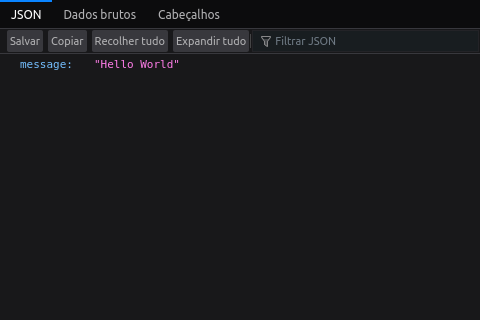
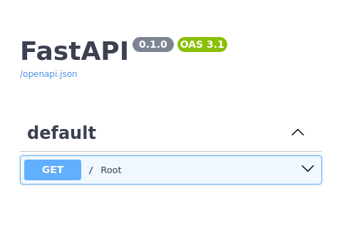
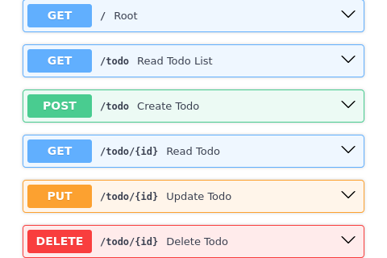
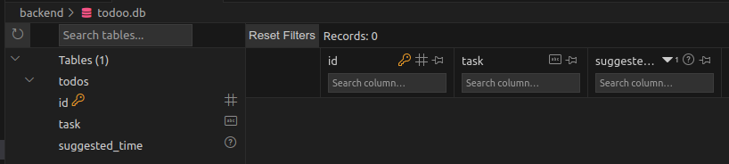
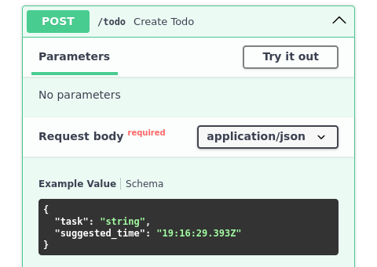

# Primeiro projeto com FastAPI e React - Parte I

---

# Preâmbulo

Utilizei [este](https://www.gormanalysis.com/blog/building-a-simple-crud-application-with-fastapi/) pequeno artigo junto com o [tutorial oficial](https://fastapi.tiangolo.com/learn/) do FastAPi para estudar um pouco sobre este famoso web framework do Python, o qual consiste em desenvolver um webapp de tarefas do dia ou mais conhecido no inglês como To Do List.

Como gostei muito do resultado, acabei decidindo por reescrever o artigo em pt-br e adicionar as minhas anotações e um extra sobre o acoplamento com React para o frontend que virá na parte 2 do artigo.

Inicialmente dividi o projeto em duas partes, cada uma relativa ao desenvolvimento do Backend e Frontend, mas pretendo adicionar novas partes para o artigo, como por exemplo: adicionar uma sessão de testes, uma sobre a utilização de outros bancos de dados diferentes do sqlite. Além disso penso em adicionar novas funcionalidades no projeto, como por exemplo: atividades diárias, as quais reaparecerão todos os dias de forma automática assim que o dia virar.

Sem mais **spoiler**, vamos ao tutorial 😄

# Introdução

Como comentado anteriormente, neste artigo iremos implementar um webapp de lista de tarefas do dia ou mais conhecido no inglês como To Do List.

Sendo assim, o artigo foi dividido em duas partes:

Parte I

- Criação de um CRUD em FastAPI
- Incorporação de um banco de dados Sqlite

Parte II

- Acoplamento com React no frontend

# Backend com FastAPI

## Instalação e configuração do ambiente

Primeiramente, é muito recomendado que você faça o [tutorial de introdução](https://fastapi.tiangolo.com/learn/) próprio do FastAPI, ele é bem simples e vale muito a pena, nesta sessão faremos algo além do tutorial oficial, pois utilizaremos o [Poetry](https://python-poetry.org/) como gerenciador de dependências, que é uma ferramenta que auxilia na manutenção da saúde dos nossos cógidos.

Sendo assim, para começar um novo projeto em Python (neste caso utilizei a versão 3.10) é sempre recomendado criar um novo ambiente virtual para ter uma melhor gestão de dependências (para não gerar um caos na nossa máquina), uma das vantagens do Poetry é que ele também nos auxilia nessa parte, neste [link](https://realpython.com/dependency-management-python-poetry/) tem um artigo em inglês que fala sobre a sua instalação e configuração de forma mais completa (não conheço um na versão pt-br, mas caso encontrar, atualizarei esta parte do artigo), recomendo também o [vídeo](https://youtu.be/0f3moPe_bhk?si=FUvQqEvEObN2-BWV) do canal ArjanCodes sobre ele, para o caso de você gostar mais dos tutoriais em vídeo, mas a instalação básica pode ser encontrada no site oficial.

Uma vez dentro da pasta do projeto e tendo dado um git init, para iniciarmos os trabalhos com o backend, utilizaremos o comando:

```bash
poetry new backend
```

Esse comando irá criar uma pasta com o nome `backend` contendo um esquema de pastas e arquivos, dentro dela poderemos encontrar o arquivo `pyproject.toml` no qual estarão as informações das dependências do nosso projeto, uma pasta com o nome `backend` que irá conter os códigos do nosso webapp, uma pasta `tests` que irá conter os nossos testes automatizados e uma pasta oculta `.venv` contendo os arquivos do nosso ambiente virtual.

Para entrar na pasta que acabamos de criar, iniciar o ambiente virtual e instalar os pacotes necessários para nosso projeto, utilizaremos a sequência de comandos:

```bash
cd backend
poetry install
poetry shell
poetry add fastapi "uvicorn[standard]"
```

Em seguida vamos verificar se as libs foram instaladas adequadamente, para isso, entraremos na pasta backend (onde iremos colocar os códigos) e criaremos um arquivo `main.py`, como a seguir:

```bash
cd backend
touch main.py
```

No seu editor de código favorito abra o arquivo `main.py`, coloque as seguintes linhas de código e salve:

**main.py**

```python
from fastapi import FastAPI

app = FastAPI()

@app.get("/")
def root():
    return {"message": "Hello World"}
```

Se tudo estiver correto, ao usar o comando: `uvicorn main:app --reload`, e abrir o endereço [http://127.0.0.1:8000/](http://127.0.0.1:8000/), aparecerá a seguinte tela:



Parabéns você fez o tutorial de introdução a qualquer linguagem de programação 😄.

Além disso, se quisermos ver a documentação **Swagger**, a qual é gerada automaticamente pelo **FastAPI**, o qual é fantástico, só precisamos ir no endereço: [http://127.0.0.1:8000/docs](http://127.0.0.1:8000/docs)



---

## Arquitetando o backend

Como usuários do nosso app, precisaremos ser capazes de criar, ler, atualizar e apagar itens na nossa lista de tarefas. Assim, inicialmente precisaremos de pelo menos 5 *endpoints*:

| Funcionalidades | Método HTTP | Path |
| --- | --- | --- |
| Criar um item | POST | /todo |
| Ler um item | GET | /todo/{id} |
| Atualizar um item | PUT | /todo/{id} |
| Apagar um item | DELETE | /todo/{id} |
| Ler todos os itens | GET | /todo |

Como é possível ver na tabela anterior, cada funcionalidade do app está relacionada a um método HTTP. Por exemplo, o *endpoint* para ler um item da lista deverá utilizar o método `GET`, o *endpoint* para apagar um item da lista deverá utilizar o método `DELETE` e assim por diante.

Além disso, na mesma tabela também é possível ver a coluna de *paths*, ou caminhos, que iremos utilizar para cada funcionalidade. No **FastAPI**, as chamadas *path operations*, que nada mais são do que a combinação de um caminho URL (ou *path*) com um método HTTP, nos permite implementar diferentes operações para o mesmo caminho URL, por exemplo, quando um `PUT` chamar o endereço `todoo.com/todo/123` a ação realizada será diferente de quanto um `DELETE` chamar o mesmo endereço.

### App - v.0.1

Para uma versão inicial o nosso app consistirá de um arquivo único, mas, iremos mudando isso conforme formos colocando novas funcionalidades 😉.

Assim, o arquivo `main.py` ficará como a seguir:

**main.py**

```python
from fastapi import FastAPI, status

app = FastAPI()

@app.get("/")
def root():
    return "App -- lista de coisas a fazer"

@app.post("/todo", status_code=status.HTTP_201_CREATED)
def create_todo():
    return "criar um item na lista"

@app.get("/todo/{id}")
def read_todo(id: int):
    return f"ler item da lista com id {id}"

@app.put("/todo/{id}")
def update_todo(id: int):
    return f"atualizar item da lista com id {id}"

@app.delete("/todo/{id}")
def delete_todo(id: int):
    return f"apagar ler item da lista com id {id}"

@app.get("/todo")
def read_todo_list():
    return "ler a lista completa de itens"
```

Ao atualizar a página da documentação teremos:



Como é possível notar no código, ao definir os paths dos métodos `put`, `delete`, e o segundo `get`, o **FastAPI** permite setar o tipo de entrada esperada, neste caso, temos apenas entradas do tipo `int` (referente ao id do item), porém, mais adiante veremos como lidar com tipos mais complexos.

Além disso, é conhecido que a resposta HTML padrão retornada cada vez que alguma operação é realizada com sucesso é **200**, neste sentido, outro detalhe importante a ser ressaltado no código anterior, é que, a fim de retornar uma resposta mais precisa, na definição do *path* do método `post` foi adicionado o parâmetro `status_code`, neste caso, a resposta escolhida foi *201 CREATED* (assumindo que o item foi criado com sucesso).

---

## Banco de dados

O próximo passo do projeto será a incorporação de um banco de dados [sqlite](https://www.sqlite.org/index.html) para armazenar os nossos itens da lista. Para isso utilizaremos a lib [sqlalchemy](https://www.sqlalchemy.org/), o qual pode ser adicionado no nosso projeto utilizando o comando: `poetry add sqlalchemy`.

### SqlAlchemy Engine

Para utilizar a lib que acabamos de instalar precisaremos criar uma instância de [Engine](https://docs.sqlalchemy.org/en/14/core/engines.html), a qual é encarregada de gerenciar:

1. Qual tipo de banco de dados iremos conectar 
2. Onde o banco está hospedado/localizado
3. Quais as credenciais para se conectar com o banco de dados
4. Várias outras configurações, como é possível ver neste [link](https://docs.sqlalchemy.org/en/14/core/engines.html#sqlalchemy.create_engine)

Para criar uma *engine*, utilizamos a função [create_engine()](https://docs.sqlalchemy.org/en/14/core/engines.html#sqlalchemy.create_engine) , e a incorporamos no nosso código adicionando as seguintes linhas de código:

```python
from sqlalchemy import create_engine

engine = create_engine("sqlite:///todoo.db")
```

Não se preocupe que mais pra frente mostraremos como ficará nosso arquivo `main.py`. 

### **SqlAlchemy Declarative**

O próximo passo a se fazer é criar um *Declarative*, a partir do último trecho de código, a chamada de criação fica como a seguir:

```python
from sqlalchemy import create_engine
from sqlalchemy.ext.declarative import declarative_base

engine = create_engine("sqlite:///todoo.db")
Base = declarative_base()
```

Esta função retorna uma *metaclasse* que explicaremos mais adiante como funciona.

### Inicialização do banco de dados

Em seguida inicializaremos nosso banco de dados, utilizando o seguinte comando `Base.metadata.create_all(engine)`, colocaremos os trechos de códigos previamente vistos antes de chamar a função de inicialização do nosso *app* (i.e., antes da linha contendo `app = FastAPI()`), dessa forma, inicializaremos nosso banco uma vez apenas.

### App - v.0.2

**main.py**

```python
from fastapi import FastAPI, status
from sqlalchemy import create_engine
from sqlalchemy.ext.declarative import declarative_base

# Criando uma instancia de engine sqlite
engine = create_engine("sqlite:///todoo.db")

# Criando uma metaclasse Declarative
Base = declarative_base()

# Criando uma base de dados
Base.metadata.create_all(engine)

# Inicializa o app
app = FastAPI()

@app.get("/")
def root():
    return "App -- lista de coisas a fazer"

@app.post("/todo", status_code=status.HTTP_201_CREATED)
def create_todo():
    return "criar um item na lista"

@app.get("/todo/{id}")
def read_todo(id: int):
    return f"ler item da lista com id {id}"

@app.put("/todo/{id}")
def update_todo(id: int):
    return f"atualizar item da lista com id {id}"

@app.delete("/todo/{id}")
def delete_todo(id: int):
    return f"apagar ler item da lista com id {id}"

@app.get("/todo")
def read_todo_list():
    return "ler a lista completa de itens"
```

Ao reiniciar nossa aplicação será possível ver que nosso banco de dados **sqlite** foi criado na mesma pasta do `main.py` com o nome de `todoo.db`.

### Criação de tabelas

Neste projeto, a princípio, precisaremos apenas de uma tabela que contenha cada item da lista de tarefas, algo como:

| Id | tarefa | horário sugerido |
| --- | --- | --- |
| 1 | Limpar a caixa de areia dos gatos | 09:00 |
| 2 | Comprar petiscos e graminha |  |
| 3 | Treinar os gatos pra usar a roda | 14:00 |

Assim, só precisaremos de três colunas: *id*, *tarefa* e *horário sugerido*, sendo o *id* a chave primária (um campo de inteiros o qual será auto incrementado), *tarefa* é um campo de *string* e *horário sugerido*, que poderá ter valores nulos além de ser um campo de *time* no formato: `HH:MM`.

Criaremos então uma classe para utilizar o **sqlalchemy** e nos comunicar com a base de dados, a qual ficará antes da inicialização do nosso *app*, como a seguir:

```python
from fastapi import FastAPI, status
from sqlalchemy import create_engine, Column, Integer, String, Time
from sqlalchemy.ext.declarative import declarative_base

# Criando uma instancia de engine sqlite
engine = create_engine("sqlite:///todoo.db")

# Criando uma metaclasse Declarative
Base = declarative_base()

# Definindo a classe ToDo, herdeira da classe Base
class ToDo(Base):
    __tablename__ = 'todos'
    id = Column(Integer, primary_key=True)
    task =  Column(String(256))
    suggested_time =  Column(Time, default=None)

# Criando uma base de dados
Base.metadata.create_all(engine)

# Inicializa o app
app = FastAPI()

@app.get("/")
def root():
    return "App -- lista de coisas a fazer"

@app.post("/todo", status_code=status.HTTP_201_CREATED)
def create_todo():
    return "criar um item na lista"

@app.get("/todo/{id}")
def read_todo(id: int):
    return f"ler item da lista com id {id}"

@app.put("/todo/{id}")
def update_todo(id: int):
    return f"atualizar item da lista com id {id}"

@app.delete("/todo/{id}")
def delete_todo(id: int):
    return f"apagar ler item da lista com id {id}"

@app.get("/todo")
def read_todo_list():
    return "ler a lista completa de itens"
```

A seguir, um resumo do que foi feito no trecho de código acima:

1. Criamos uma classe `ToDo`que herdou as propriedades da classe `Base`, a qual fará a correspondência com a tabela `todos` no banco de dados, sendo que cada instância da nossa classe ToDo corresponderá a uma linha da tabela `todos`.
2. Foram dados 4 atributos para a classe `ToDo`:
    1. `__tablename__ = 'todos'`: utilizada para definir o nome “todos” na tabela no nosso banco de dados
    2. `id = Column(Integer, primary_key=True)`: utilizada para definir a chave primária da tabela como uma coluna de inteiros chamada “id” (auto incremental por padrão)
    3. `task = Column(String(256))`: utilizada para criar um campo de *string* (de até 256 caracteres) na tabela todos chamado “*task*”
    4. `suggested_time =  Column(Time, default=None)`: utilizada para criar um campo do tipo *Time* o qual é opcional pois temos o parâmetro `default=None`
3. Inicializar as tabelas com o comando `Base.metadata.create_all(engine)`

Depois de reiniciar nossa aplicação, a tabela `todos` será criada dentro do banco `todoo.db`, e, utilizando algum visualizador de bancos de dados para *sqlite*, poderemos ver que a tabela `todos` está vazia:



No meu caso utilizei uma extensão do próprio vscode: ****SQLite Viewer****, o qual também possui uma [versão web](https://sqliteviewer.app/).

### Refatorando o código: App - v.0.3

Para que o código seja mais legível e intuitivo, precisaremos refatorá-lo, assim, colocaremos toda a lógica envolvendo o banco de dados num arquivo: `database.py`, o qual ficará no mesmo diretório que o nosso arquivo `main.py`, para em seguida importá-lo, ficando o seguinte esquema de arquivos:

**database.py**

```python
from sqlalchemy import create_engine, Column, Integer, String, Time
from sqlalchemy.ext.declarative import declarative_base

# Criando uma instancia de engine sqlite
engine = create_engine("sqlite:///todoo.db")

# Criando uma metaclasse Declarative
Base = declarative_base()

# Definindo a classe ToDo, herdeira da classe Base
class ToDo(Base):
    __tablename__ = "todos"
    id = Column(Integer, primary_key=True)
    task = Column(String(256))
    suggested_time = Column(Time, default=None)
```

**main.py**

```python
from fastapi import FastAPI, status
from database import Base, engine

# Criando a base de dados
Base.metadata.create_all(engine)

# Inicializa o app
app = FastAPI()

@app.get("/")
def root():
    return "App -- lista de coisas a fazer"

@app.post("/todo", status_code=status.HTTP_201_CREATED)
def create_todo():
    return "criar um item na lista"

@app.get("/todo/{id}")
def read_todo(id: int):
    return f"ler item da lista com id {id}"

@app.put("/todo/{id}")
def update_todo(id: int):
    return f"atualizar item da lista com id {id}"

@app.delete("/todo/{id}")
def delete_todo(id: int):
    return f"apagar ler item da lista com id {id}"

@app.get("/todo")
def read_todo_list():
    return "ler a lista completa de itens"
```

---

## Operações do CRUD

### Create

O primeiro passo ao criar um novo item é estabelecer a sua lógica, neste caso é esperado que o usuário entre com algumas informações, a tarefa e o horário sugerido, caso ele exista. Como a criação de objetos acontece via *POST*, os dados serão enviados pelo corpo do *request HTTP*, como explicado no seguinte [link](https://fastapi.tiangolo.com/tutorial/body/).

Assim, precisamos declarar um modelo *pydantic* ToDo:

```python
from pydantic import BaseModel
from typing import Union
from datetime import time

# Criando modelo ToDoRequest(Base)
class ToDoRequest(BaseModel):
    task: str
    suggested_time: Union[time, None] = None
```

Diferente do modelo que se encontra em `database.py`, este modelo *pydantic* é o responsável por definir o formato da entrada dos dados ao criar um novo item na nossa lista de tarefas. Como é possível ver, neste modelo o `id` do item não é passado como parâmetro, uma vez que ao criar o item no banco um `id` será atribuído de forma automática a ele. Sendo assim, só precisamos passar a *task* e o *suggested_time*, sendo este último podendo ser nulo.

Além disso, precisaremos passar nosso modelo na chamada da nossoa função `create_todo`:

```diff
...
@app.post("/todo", status_code=status.HTTP_201_CREATED)
-def create_todo():
+def create_todo(todo: ToDoRequest):
    return "criar um item na lista"
...
```

Ficando da seguinte forma:

**main.py**

```python
from fastapi import FastAPI, status
from database import Base, engine
from pydantic import BaseModel
from datetime import time
from typing import Union

# Criando modelo ToDoRequest(Base)
class ToDoRequest(BaseModel):
    task: str
    suggested_time: Union[time, None] = None

# Criando a base de dados
Base.metadata.create_all(engine)

# Inicializa o app
app = FastAPI()

@app.get("/")
def root():
    return "App -- lista de coisas a fazer"

@app.post("/todo", status_code=status.HTTP_201_CREATED)
def create_todo(todo: ToDoRequest):
    return "criar um item na lista"

@app.get("/todo/{id}")
def read_todo(id: int):
    return f"ler item da lista com id {id}"

@app.put("/todo/{id}")
def update_todo(id: int):
    return f"atualizar item da lista com id {id}"

@app.delete("/todo/{id}")
def delete_todo(id: int):
    return f"apagar ler item da lista com id {id}"

@app.get("/todo")
def read_todo_list():
    return "ler a lista completa de itens"
```

Dessa forma nossa *API* ficará “ciente” de que algo semelhante a um *ToDoRequest* deve ser passado para o corpo da *request HTTP* do *endpoint* `POST /todo`. Aqui é importante verificar o funcionamento da nossa *API*, é esperado então que na documentação apareça o seguinte: 



Como é possível ver, nosso modelo *pydantic* está sendo solicitado ao chamar a operação *POST.*

Caso tudo tiver corrido bem, o próximo passo é conseguir que essa informação seja adicionada no banco de dados, para isso realizamos as seguintes importações e modificações no cabeçalho do nosso `main.py`:

```diff
...
-from database import Base, engine
+from database import Base, engine, ToDo
from pydantic import BaseModel
+from sqlalchemy.orm import Session
...
```

Além de modificar a função `create_todo`, como a seguir:

```python
...
@app.post("/todo", status_code=status.HTTP_201_CREATED)
def create_todo(todo: ToDoRequest):
    # Criando uma nova sessão da base de dados
    session = Session(bind=engine, expire_on_commit=False)

    # Criando uma instância do modelo de banco de dados ToDo
    tododb = ToDo(task=todo.task, suggested_time=todo.suggested_time)

    # Adicionando a instância e comitando
    session.add(tododb)
    session.commit()

    # Pegando a id dada ao objeto pela base de dados
    id = tododb.id

    # Encerrando a sessão
    session.close()
	
    return f"criado um item na lista com a id {id}"
...
```

As modificações pontuais foram as seguintes:

1. Dentro de `create_todo()` é inicializada uma nova sessão de banco de dados, a qual serve para facilitar a troca de dados entre o banco de dados e nossa API
2. Usamos os dados recebidos do *request* (i.e. do objeto ToDoRequest, `todo`) para criar uma instância do modelo de banco de dados `ToDo` que chamaremos de `tododb`
3. Adicionamos o `tododb` na sessão e *comitamos*
4. A sessão automaticamente atualizará nosso objeto `tododb` com o `id` gerado pelo banco de dados
5. Retornamos o `id` como uma *string* de resposta.

Claramente nosso código não está implementado da forma mais correta, mas o refatoraremos mais adiante.

Neste ponto do artigo, se testar o *endpoint* que acabamos de criar, será possível notar que é possível adicionar novas tarefas no nosso banco, um detalhe importante é que não ainda cobrirmos o caso para *string* vazia no campo de *time*, apenas adicionamos a possibilidade de ter `null` no corpo da *request HTTP* correspondente.

### Read

Para esta operação implementaremos duas opções:

1. `read_todo(id: int)` para ler um item com um `id` específico
2. `read_todo_list():` para ler todos os items

Começaremos com o primeiro caso `read_todo(id: int)`, pelo que modificaremos nosso cabeçalho como a seguir:

```diff
...
-from fastapi import FastAPI, status
+from fastapi import FastAPI, status, HTTPException
...
```

Nossa função `read_todo` ficará como a seguir:

```python

...

@app.get("/todo/{id}")
def read_todo(id: int):
    # Criando uma nova sessão da base de dados
    session = Session(bind=engine, expire_on_commit=False)

    # Pegando um item pelo id na base de dados
    todo = session.query(ToDo).get(id)

    # Encerrando a sessão
    session.close()

    # Verificando se o item existe ao ser procurado pelo id
    # Se não, levanta uma exceção e retorna 404: não encontrado
    if not todo:
        raise HTTPException(status_code=404, detail=f"item com o {id} não encontrado")
    
    return todo
...

```

No trecho de código anterior foram realizadas as seguintes modificações:

1. Dentro de `read_todo()`, assim como no caso anterior, inicializamos uma nova sessão de banco de dados. Neste ponto a gente pode se perguntar, é possível inicializar uma sessão apenas uma vez e cobrir todas as operações? A resposta é sim, e veremos mais adiante
2. Procuramos o item com a `id` desejada e encerramos a sessão
3. Verificamos se foi possível localizar o item através do `id` passado, e caso tenha sido possível encontrar o item o retornamos, caso contrário retornamos uma resposta de erro *NOT FOUND 404*.

Agora veremos como retornar todos os items da lista, felizmente o FastAPI consegue serializar de maneira simples para o caso de termos uma coleção aninhada de itens, sendo assim, adicionaremos o seguinte trecho de código no nosso `main.py`:

```python
...
@app.get("/todo")
def read_todo_list():
		# Criando uma nova sessão da base de dados
    session = Session(bind=engine, expire_on_commit=False)

    # Pegando todos os itens do banco
    todo_list = session.query(ToDo).all()

    # Encerrando a sessão
    session.close()

    return todo_list
...
```

### Update

Para atualizar um item existente, podemos utilizar algumas das ideias que já tivemos até agora, como por exemplo, fazer a busca pelo id e passar a nova informação a ser atualizada no formato formato da classe `ToDoRequest`, a nossa função `update_todo` ficará então da seguinte forma:

```python
...
@app.put("/todo/{id}")
def update_todo(id: int, todo_mod: ToDoRequest):
		# Criando uma nova sessão da base de dados
    session = Session(bind=engine, expire_on_commit=False)

    # Pegando um item pelo id na base de dados
    todo = session.query(ToDo).get(id)

    # Atualizar um item com as novas informações (caso for encontrado)
    if todo:
        todo.task = todo_mod.task
        todo.suggested_time = todo_mod.suggested_time
        session.commit()

    # Encerrando a sessão
    session.close()

    # Verificando se o item existe ao ser procurado pelo id
    # Se não, levanta uma exceção e retorna 404: não encontrado
    if not todo:
        raise HTTPException(status_code=404, detail=f"item com o {id} não encontrado")

    return todo
...
```

Nesta função:

1. Foi adicionado o parâmetro `todo_mod: ToDoRequest` de modo a enviar a informação a ser modificada no formato da classe `ToDoRequest`
2. Utilizamos `if todo:` para verificar se a o item solicitado existe ao ser procurado pelo id. Caso for verdade, atualizamos os seus dados e atualizamos o banco de dados *comitando* com `session.commit()`, caso contrário retornaremos uma mensagem de erro *NOT FOUND 404*.

### Delete

Por último, mas não menos importante, precisamos ter o poder excluir um item passando para isso o `id` correspondente.

```python
...
@app.delete("/todo/{id}", status_code=status.HTTP_204_NO_CONTENT)
def delete_todo(id: int):

    # Criando uma nova sessão da base de dados
    session = Session(bind=engine, expire_on_commit=False)

    # Pegando um item pelo id na base de dados
    todo = session.query(ToDo).get(id)

    # Caso o item for encontrado ele será excluído do banco de dados 
		# Se não, levanta uma exceção e retorna 404: não encontrado
    if todo:
        session.delete(todo)
        session.commit()
        session.close()
    else:
        raise HTTPException(status_code=404, detail=f"item com o {id} não encontrado")

    return None
...
```

Para a lógica desta função:

1. Adicionamos o parâmetro `status_code=status.HTTP_204_NO_CONTENT`, caso o item for deletado com sucesso
2. Retornar `None` no fim da função, uma vez que o estatus já estará retornando a informação desejada.
3. Para excluir um item procuramos pelo seu `id` no banco, em seguida fazemos `session.delete(todo)` seguido de `session.commit()`.
---

## Refatorando o código

Para finalizar este artigo, estaremos refatorando o código a fim melhorar a sua escrita,  desempenho e corrigindo o tipo de respostas na documentação da nossa API. 

A começar pela escrita, no momento, nosso código não faz uma distinção clara entre o modelo ToDo de banco de dados e o modelo *Pydantic* ToDo, o que dificultaria no momento de fazer manutenção ou adicionar novas funcionalidades no código.

Na documentação do FastAPI é sugerido chamar os modelos *Pydantic* de *schemas* para ajudar a tornar a distinção clara. Consequentemente, vamos colocar todos os nossos modelos de banco de dados em um arquivo `models.py` e todos os nossos modelos *Pydantic* em um arquivo `schemas.py`. Assim, precisaremos atualizar o nossos arquivos: `database.py` e `main.py` para adaptalos no esquema proposto, ficando da seguinte forma:

**models.py**

```python
from sqlalchemy import Column, Integer, String, Time
from database import Base

# Definindo a classe ToDo, herdeira da classe Base
class ToDo(Base):
    __tablename__ = 'todos'
    id = Column(Integer, primary_key=True)
    task = Column(String(256))
    suggested_time = Column(Time, default=None)
```

**schemas.py**

```python
from pydantic import BaseModel
from datetime import time
from typing import Union

# Criando a classe ToDoRequest, herdeira da classe BaseModel (Pydantic)
class ToDo(BaseModel):
    task: str
    suggested_time: Union[time, None] = None
```

**Observação**: aqui alteramos o nome da classe de ToDoRequest apenas para ToDo, já que não terá mais o problema de duplicação pois chamaremos cada classe de forma específica, como será visto no arquivo `main.py`.

**database.py**

```python
from sqlalchemy import create_engine
from sqlalchemy.ext.declarative import declarative_base

# Criando uma instancia de engine sqlite
engine = create_engine("sqlite:///todoo.db")

# Criando uma metaclasse Declarative
Base = declarative_base()
```

**main.py**

```python
from fastapi import FastAPI, status, HTTPException
from database import Base, engine
from sqlalchemy.orm import Session
import models
import schemas

# Criando a base de dados
Base.metadata.create_all(engine)

# Inicializa o app
app = FastAPI()

@app.get("/")
def root():
    return "App -- lista de tarefas"

@app.post("/todo", status_code=status.HTTP_201_CREATED)
def create_todo(todo: schemas.ToDo):
    # Criando uma nova sessão da base de dados
    session = Session(bind=engine, expire_on_commit=False)

    # Criando uma instancia do modelo de banco de dados ToDo
    tododb = models.ToDo(task=todo.task, suggested_time=todo.suggested_time)

    # Adicionando a instância e comitando
    session.add(tododb)
    session.commit()

    # Pegando a id dada ao objeto pela base de dados
    id = tododb.id

    # Encerrando a sessão
    session.close()

    return f"criado um item na lista com a id: {id}"

@app.get("/todo/{id}")
def read_todo(id: int):
    # Criando uma nova sessão da base de dados
    session = Session(bind=engine, expire_on_commit=False)

    # Pegando o item pelo id da base de dados
    todo = session.query(models.ToDo).get(id)

    # Encerrando a sessão
    session.close()

    # Verificando se o item existe ao ser procurado pelo id
    # Se não, levanta uma exceção e retorna 404: não encontrado
    if not todo:
        raise HTTPException(status_code=404, detail=f"item com o id: {id}, não encontrado"")

    return todo

@app.put("/todo/{id}")
def update_todo(id: int, todo: schemas.ToDo):
    # Criando uma nova sessão da base de dados
    session = Session(bind=engine, expire_on_commit=False)

    # Pegando um item pelo id na base de dados
    todo_mod = session.query(ToDo).get(id)

    # Atualizar um item com as novas informações (caso for encontrado)
    if todo_mod:
        todo_mod.task = todo.task
        todo_mod.suggested_time = todo.suggested_time
        session.commit()

    # Encerrando a sessão
    session.close()

    # Verificando se o item existe ao ser procurado pelo id
    # Se não, levanta uma exceção e retorna 404: não encontrado
    if not todo_mod:
        raise HTTPException(status_code=404, detail=f"item com o id: {id}, não encontrado"")

    return todo_mod

@app.delete("/todo/{id}", status_code=status.HTTP_204_NO_CONTENT)
def delete_todo(id: int):
    # Criando uma nova sessão da base de dados
    session = Session(bind=engine, expire_on_commit=False)

    # Pegando um item pelo id na base de dados
    todo = session.query(models.ToDo).get(id)

    # Caso o item for encontrado ele será excluído do banco de dados
    # Se não, levanta uma exceção e retorna 404: não encontrado
    if todo:
        session.delete(todo)
        session.commit()
        session.close()
    else:
        raise HTTPException(status_code=404, detail=f"item com o id: {id}, não encontrado"")

    return None

@app.get("/todo")
def read_todo_list():
    # Criando uma nova sessão da base de dados
    session = Session(bind=engine, expire_on_commit=False)

    # Pegando todos os itens do banco
    todo_list = session.query(models.ToDo).all()

    # Encerrando a sessão
    session.close()

    return todo_list
```

Conforme comentado anteriormente, no arquivo `main.py` importamos nossas libs de *models* e *schemas*, referenciamos todas as classes ToDo como `models.ToDo` ou `schemas.ToDo`, ficando claro no código onde estamos usando um modelo de banco de dados e onde estamos usando um modelo *Pydantic*.

### Retornando *modelos* como respostas

Ao verificar a documentação para nosso *endpoint* `GET todo/{id}`, é possível ver que junto com a resposta 200 de operação bem-sucedida, é retornada uma *string*, mas isso não é verdade, já que a função retorna a representação JSON de um item caso ele tenha sido encontrado.

Este erro ocorre pois não especificamos um `response_model` no *decorator* de operação de caminho `@app.get()`. Para fazer isso, podemos simplesmente adicionar o parâmetro `response_model=schemas.ToDo` no decorator, como mostrado a seguir:

```diff
-@app.get("/todo/{id}")
+@app.get("/todo/{id}", response_model=schemas.ToDo)
```

Entretanto, ao utilizar o `schemas.ToDo`, a nossa solução não fica 100% correta, já que inicialmente quando criamos a classe `schemas.ToDo`, não incluímos o atributo `id`, pois essa classe seria utilizada na função de operação do caminho `create_todo()`, onde o usuário não sabe o `id` antecipadamente, uma vez que ele será gerado pelo banco de dados de forma automática.

Assim, faz mais sentido criar uma nova classe ou esquema que possua o atributo `id`, atualizaremos então nosso arquivo `schemas.py` de forma bem conveniente, ficando assim:

**schemas.py**

```python
from pydantic import BaseModel
from datetime import time
from typing import Union

# Criando a classe ToDoRequest, herdeira da classe BaseModel (Pydantic)
class ToDo(BaseModel):
    task: str
    suggested_time: Union[time, None] = None

class ToDoWithId(BaseModel):
    id: int
    task: str
    suggested_time: Union[time, None] = None
```

Não esqueçamos de mudar o seguinte:

```diff
-@app.get("/todo/{id}", response_model=schemas.ToDo)
+@app.get("/todo/{id}", response_model=schemas.ToDoWithId)
```

Além desse *endpoint,* vamos modificar o *endpoint* da operação *create* para que retorne também o modelo criado como resposta, ao invés de apenas o `id`. Ficará então como a seguir:

```python
...
@app.post("/todo", response_model=schemas.ToDoWithId, status_code=status.HTTP_201_CREATED)
def create_todo(todo: schemas.ToDo):
    # Criando uma nova sessão da base de dados
    session = Session(bind=engine, expire_on_commit=False)

    # Criando uma instancia do modelo de banco de dados ToDo
    tododb = models.ToDo(task=todo.task, suggested_time=todo.suggested_time)

    # Adicionando a instância e comitando
    session.add(tododb)
    session.commit()

    # Pegando a id dada ao objeto pela base de dados
    session.refresh(tododb)

    # Encerrando a sessão
    session.close()

    return tododb
...
```

A sacada aqui consiste em chamar a função `session.refresh(tododb)` após o `session.commit()`, pois ao atualizar a sessão, o objeto `tododb` será atualizado, passando a ter o id gerado pelo banco de dados.

De modo semelhante o *endpoint* da operação *update* ficará como a seguir:

```python
...
@app.put("/todo/{id}", response_model=schemas.ToDoWithId)
def update_todo(id: int, todo: schemas.ToDo):
    # Criando uma nova sessão da base de dados
    session = Session(bind=engine, expire_on_commit=False)

    # Pegando um item pelo id na base de dados
    todo_mod = session.query(models.ToDo).get(id)

    # Atualizar um item com as novas informações (caso for encontrado)
    if todo_mod:
        todo_mod.task = todo.task
        todo_mod.suggested_time = todo.suggested_time
        session.commit()

    # Encerrando a sessão
    session.close()

    # Verificando se o item existe ao ser procurado pelo id
    # Se não, levanta uma exceção e retorna 404: não encontrado
    if not todo_mod:
        raise HTTPException(status_code=404, detail=f"item com o id: {id}, não encontrado")

    return todo_mod
...
```

Corrigir o *path operation* `read_todo_list()` é um pouco mais complexo, pois a resposta esperada é uma lista de objetos JSON, sendo assim, precisaremos importar a lib: `from typing import List` e modificar o decorator relacionado como a seguir: 

```diff
-@app.get("/todo")
+@app.get("/todo", response_model = List[schemas.ToDoWithId])
```

Entretanto, será preciso adicionar uma outra configuração não muito intuitiva no *schema* ToDoWithId, ficando assim:

**schemas.py**

```python
from pydantic import BaseModel
from datetime import time
from typing import Union, Optional

# Criando a classe ToDoRequest, herdeira da classe BaseModel (Pydantic)
class ToDo(BaseModel):
    task: str
    suggested_time: Union[time, None] = None

class ToDoWithId(BaseModel):
    id: int
    task: str
    suggested_time: Union[time, None] = None

    class Config:
        from_attributes = True
```

### Otimizando o uso de *session*

Como comentado anteriormente, existem trechos de códigos se repetindo em todas as operações de *path*, mas existem formas de evitar que isso aconteça. Em primeiro lugar, podemos usar a opção `sessionmaker` do sqlalchemy. Com ele, podemos especificar os parâmetros de sessão que queremos chamar apenas uma vez, em vez de fazer várias chamadas como por exemplo: `session = Session(bind=engine, expire_on_commit=False)`, a seguir aplicaremos algumas mudanças nos nossos códigos:

**database.py**

```python
from sqlalchemy import create_engine
from sqlalchemy.ext.declarative import declarative_base
from sqlalchemy.orm import sessionmaker

# Criando uma instancia de engine sqlite
engine = create_engine("sqlite:///todoo.db")

# Criando uma metaclasse Declarative
Base = declarative_base()

# Criando uma classe SessionLocal de sessionmaker
SessionLocal = sessionmaker(bind=engine, expire_on_commit=False)
```

Em seguida será preciso chamar ele no `main.py`:

```diff
-from database import Base, engine
+from database import Base, engine, SessionLocal
```

Agora, ao invés de criar uma sessão dentro de cada uma das funções que criamos, poderemos inserir um parâmetro de sessão, cada um desses parâmetros de sessão poderá ter um valor padrão relativo à função `get_session()`, a qual será adicionada antes da chamada do app, como a seguir:

**main.py**

```python
from fastapi import FastAPI, status, HTTPException, Depends
from database import Base, engine, SessionLocal
from sqlalchemy.orm import Session
import models
import schemas
from typing import List

# Criando a base de dados
Base.metadata.create_all(engine)

# Função auxiliar para obter sessão de banco de dados
def get_session():
    session = SessionLocal()
    try:
        yield session
    finally:
        session.close()

# Inicializa o app
app = FastAPI()

@app.get("/")
def root():
    return "App -- lista de tarefas"

@app.post(
    "/todo", response_model=schemas.ToDoWithId, status_code=status.HTTP_201_CREATED
)
def create_todo(todo: schemas.ToDo, session: Session = Depends(get_session)):
    # Criando uma instancia do modelo de banco de dados ToDo
    tododb = models.ToDo(task=todo.task, suggested_time=todo.suggested_time)

    # Adicionando a instância e comitando
    session.add(tododb)
    session.commit()

    # Pegando a id dada ao objeto pela base de dados
    session.refresh(tododb)

    return tododb

@app.get("/todo/{id}", response_model=schemas.ToDoWithId)
def read_todo(id: int, session: Session = Depends(get_session)):
    # Pegando o item pelo id da base de dados
    todo = session.query(models.ToDo).get(id)

    # Verificando se o item existe ao ser procurado pelo id
    # Se não, levanta uma exceção e retorna 404: não encontrado
    if not todo:
        raise HTTPException(
            status_code=404, detail=f"item com o id: {id}, não encontrado"
        )

    return todo

@app.put("/todo/{id}", response_model=schemas.ToDoWithId)
def update_todo(id: int, todo: schemas.ToDo, session: Session = Depends(get_session)):
    # Pegando um item pelo id na base de dados
    todo_mod = session.query(models.ToDo).get(id)

    # Atualizar um item com as novas informações (caso for encontrado)
    if todo_mod:
        todo_mod.task = todo.task
        todo_mod.suggested_time = todo.suggested_time
        session.commit()

    # Verificando se o item existe ao ser procurado pelo id
    # Se não, levanta uma exceção e retorna 404: não encontrado
    if not todo_mod:
        raise HTTPException(
            status_code=404, detail=f"item com o id: {id}, não encontrado"
        )

    return todo_mod

@app.delete("/todo/{id}", status_code=status.HTTP_204_NO_CONTENT)
def delete_todo(id: int, session: Session = Depends(get_session)):
    # Pegando um item pelo id na base de dados
    todo = session.query(models.ToDo).get(id)

    # Caso o item for encontrado ele será excluído do banco de dados
    # Se não, levanta uma exceção e retorna 404: não encontrado
    if todo:
        session.delete(todo)
        session.commit()
    else:
        raise HTTPException(
            status_code=404, detail=f"item com o id: {id}, não encontrado"
        )

    return None

@app.get("/todo", response_model=List[schemas.ToDoWithId])
def read_todo_list(session: Session = Depends(get_session)):
    # Pegando todos os itens do banco
    todo_list = session.query(models.ToDo).all()

    return todo_list
```

Repare que além de importar a função *Depends* no cabeçalho*,* em cada função foi adicionado o parâmetro: `session: Session = Depends(get_session)`, ao mesmo tempo que removemos as linhas de criação e fechamento de sessões.

---

## Conclusão

Com a finalização do nosso backend concluímos a primeira parte do nosso projeto, onde fomos capazes de abordar: 

- A instalação e configuração do ambiente de desenvolvimento e de web framework
- Criação do banco de dados e das tabelas utilizando sqlalchemy
- Utilização de pydantic para validação dos dados de entrada e saída da nossa API
- Refatoração do nosso código para facilitar a sua leitura e manutenção

Na segunda parte abordaremos o acoplamento com o frontend, com isso, precisaremos adicionar algumas coisas no nosso backend, mas será pouca coisa.

Como não sou muito bom no frontend, espero conseguir entregar algo no mínimo aceitável 😅, e é claro que qualquer melhoria ou sugestão será muito bem vinda, tanto no frontend quanto backend.

Obrigado por ter chegado até aqui, espero que tenha sido de ajuda e te espero na segunda parte do projeto.